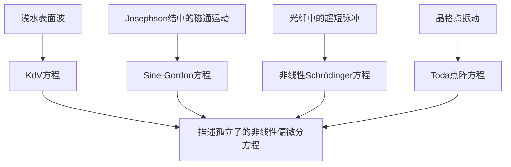
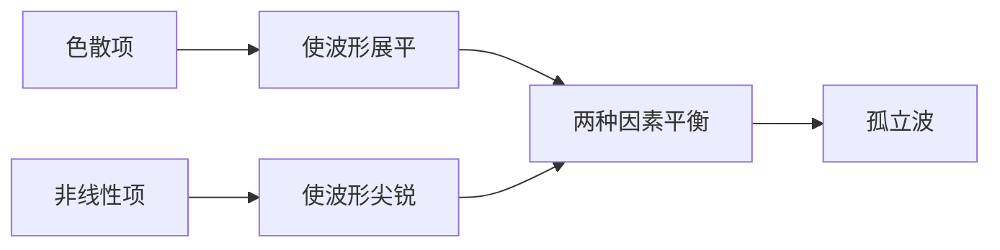

---
presentation:
    theme: solarized.css
    width: 800
    height: 550
    progress: true
    mouseWheel: true
---

<!-- slide -->

# 开题报告

**非线性 Schrödinger 方程的数值模拟**

<!-- slide -->

## 课题背景

<!-- slide -->

**Russel 的发现**

    <video src="./浅水中的孤立波.mp4" width="600" height="360" controls="controls"></video>

<!-- slide -->

**孤子方程**

<!-- slide -->

**孤子本质**

$$
\frac{\partial u}{\partial t}+\underset{非线性项}{\boxed{\alpha u\frac{\partial u}{\partial x}}}+\underset{色散项}{\boxed{\frac{\partial^3 u}{\partial x^3}}}=0\hspace{4ex}KdV方程
$$

<!-- slide -->

**光纤中的非线性  Schrödinger 方程**

$$
i\frac{\partial A}{\partial T}+\frac{i\alpha}{2}A-\underset{色散项}{\boxed{\frac{\beta_2}{2}\frac{\partial^2A}{\partial T^2}}}+\underset{非线性项}{\boxed{\gamma|A|^2A}}=0
$$

<!-- slide -->

## 研究初衷

<!-- slide -->

* 这是一道华科夏令营活动的题目；
* 孤子问题来自实际现象，并且非常有趣；
* 我本人以后想做物理仿真工作；
* ~~自相位调制；~~
* ~~光孤子通信；~~

<!-- slide -->

## 目标与行动

<!-- slide -->

**目的** 

对非线性 Schrödinger 方程进行数值模拟

**计算方法**

谱方法、有限差分、有限元 ...

**物理图像**

光孤子、色散、自相位调制 ...

<!-- slide -->

## 进度计划

<!-- slide -->

**计划**

- 了解孤子理论和非线性Schrödinger方程
- 学习数值模拟方法
- 用Matlab编程模拟并分析物理图像
- 总结工作，改进方法，撰写毕业设计论文

<!-- slide -->

**谢谢聆听！**